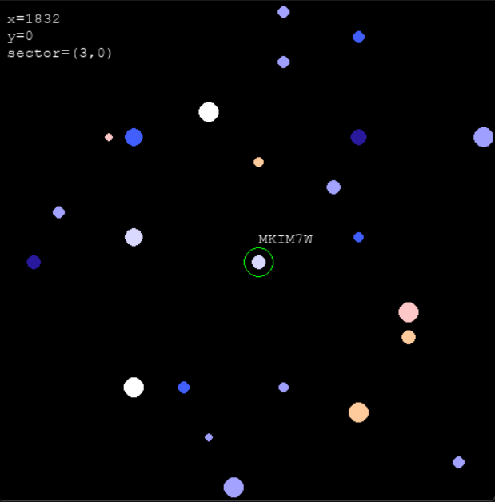

# Multiverse
Persistent randomized generation of the universe with extraterrestrial life. 

Multiverse is a simple project that demonstrates the concept of persistent procedural generation with location-based
random seeds. In this project, a 2D virtual galaxy is generated with celestial bodies, where properties of each are determined 
by a unique seed based on the location within the galaxy. User can navigate the galaxy to find planets with life, which are marked
with a green ring around them.




# Persistent Generation
The universe is generated procedurally, but the generation is persistent. This means that the same seed will always
generate the same universe. On a 64-bit system, the universe is enormously large, on the order of $2^{64}$ by $2^{64}$ 
(or roughly $10^{19}$ by $10^{19}$) pixels. Given 500-by-500 pixels per screen, 20-by-20 grid size of the screen, and 
10% probability of a body existing in each grid, there will be roughly $10^{28}$ bodies in this digital universe -- more than 
number of stars and plants in our (real) universe! Of course, the universe is not generated all at once. Instead, 
it is generated on-demand as the user navigates through the universe.

Unfortunately, not all the bodies are independent, as the generation is based on the location of the body. This is 
done by combining $x$ and $y$ coordinate of the bodies (with respect to the center of the universe) to form a 64-bit seed below
```python
seed = (x & 0xFFFFFFFF) << 32 | (y & 0xFFFFFFFF)
```
Due to bit-shift and bitwise-or operations, there are roughly $10^{19}$ unique seeds. This means that there are
at most $10^{19}$ unique bodies in the universe. This is still a large number -- considering that there are (only) roughly $10^{11}$
stars in the Milky Way.

# Installation
1. clone the repository 
    ```bash
    git clone https://github.com/ahemmatifar/multiverse.git
    ```
2. Change to project directory and install the project
    ```bash
    cd multiverse
    make dev_install
    ```
3. Run the project
    ```bash
    make run
    ```
4. Additionally, if interested to build from source, use
    ```bash
    make build
    ```

# License
This project is licensed under the MIT License. See the [LICENSE](LICENSE) file for details.

# Acknowledgements
- Inspired by procedural generation of the universe by [javidx9](https://www.youtube.com/watch?v=ZZY9YE7rZJw).
- The Pygame community for providing a great library for game development in Python.